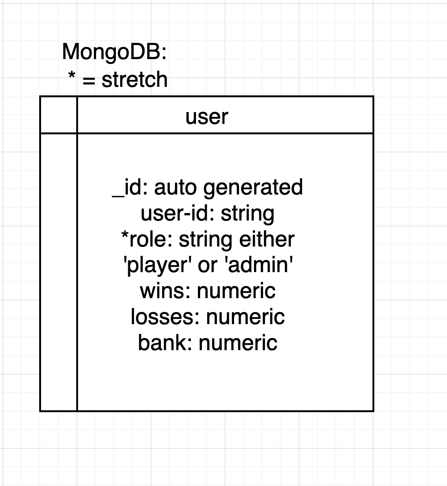
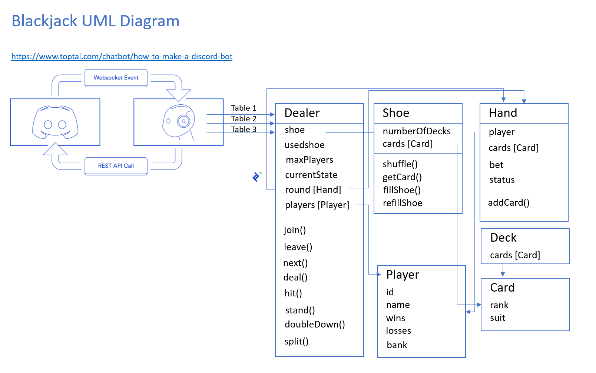
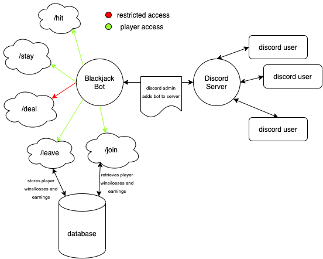

# Black Jack Discord Bot

## Deployment

[Heroku Deployment](https://latte-blackjack.herokuapp.com/)

## Team Members

* Aysia Brown
* Tina Myers
* Dina Ayoub
* Matt Ravenmoore

## Project Management

### Task Management

* [Trello Board](https://trello.com/b/bgJWAadZ/blackjack)

### Domain Modeling

### Entity Relationship Diagram

### UML Diagram

### Data Flow Diagram

## MVP

* REST API

## How to use

### ENV file

* PORT
* MONGODB_URI
* BOT_TOKEN

### Postman Instructions

* take Heroku deployment link 'https://latte-blackjack.herokuapp.com' and add the following:
* "/game" to start the game. Take the dealer ID provided, and use in the following commands
* add a player (or multiple players if preferred): 'https://latte-blackjack.herokuapp.com/join/{dealerid}/{userid}'
* begin the actual game 'https://latte-blackjack.herokuapp.com/next/{dealerid}'
* each player sets a bet in a query string (repeat for all players): 'https://latte-blackjack.herokuapp.com/next/{dealerid}/bets?amount={amount between 5 and 50}'
* deal the cards: 'https://latte-blackjack.herokuapp.com/next/{dealerid}'
* allow the player to hit or stand (until the player chooses stand or the player busts/gets 21): 'https://latte-blackjack.herokuapp.com/next/{dealerid}/{hit or stand}'
* when all players have reached stand/bust/blackjack, move to dealer turn: 'https://latte-blackjack.herokuapp.com/next/{dealerid}'
* dealer turn will automatically hit if total is under 17, or stand if 17 or over. Dealer could also bust. 'https://latte-blackjack.herokuapp.com/next/{dealerid}'
* players will get paid out for their winnings (if the player won or pushed). Banks will be updated, win/loss/push totals will be updated: 'https://latte-blackjack.herokuapp.com/next/{dealerid}'
* if a player wishes to leave the game, they must type this before the next round begins: 'https://latte-blackjack.herokuapp.com/leave/{dealerid}/{playerid}
* next round will start with: 'https://latte-blackjack.herokuapp.com/next/{dealerid}'

## Tests

### Usage

* to run tests, use the command 'npm test'

### List of tests

#### Dealer tests

* [x] Can create a new dealer object
* [x] Can correctly throw an error if we try to start a game without any players
* [x] Can ask low bank players to buyin before start of hand
* [x] Can add a player to the game for next round
* [x] Can start a game using the start function
* [x] Can place bets for all non-dealers players
* [x] Can remove a player from the game for next round
* [x] Can deal a hand to each player
* [x] Can playerturn hit - add a card to the current Player\'s hand
* [x] Can playerturn stand - stop adding cards to the player\'s hand on stand
* [x] Can have dealer hit when their hand total is < 17
* [x] Can have dealer bust when their hand total > 21
* [x] Can have dealer stand when their hand total is >= 17 & <21
* [x] Can payout players correctly when dealer stands >=17 & <21

#### Next() function tests --> the function used in our API

* [x] Can start a game using the next function
* [x] Can place bets for all non-dealers players
* [x] Can deal a hand to each player
* [x] Can playerturn hit - add a card to the current Player\'s hand
* [x] Can playerturn stand after each player\'s turn - stop adding cards to the player\'s hand on stand
* [x] Can have dealer hit when their hand total is < 17
* [x] Can have dealer stand when their hand total is >= 17 & <21
* [x] Can payout players correctly when dealer stands >=17 & <21

#### Card tests

* [x] Can create a new card object

#### Deck tests

* [x] Can instantiate a new deck of cards

#### Hand tests

* [x] Can create a new hand object
* [x] Can add a card to a hand
* [x] Can add multiple cards to a hand
* [x] Can get the count of a hand with a face (K/Q/J)
* [x] Can get the count of a blackjack hand with a face (K/Q/J) and an ace
* [x] Can get the count of a hand with a face (K/Q/J) and ace and number
* [x] Can get the count of a hand with two aces
* [x] Can get the count of a hand with two aces and a card

#### Player

* [x] Can create a new player object

#### Shoe

* [x] Can create a new shoe object
* [x] Can fill the shoe with cards
* [x] Can get one card from the shoe
* [x] Can refill the shoe when shuffled
* [x] Can re-shuffle when <20% of the deck remains

#### Users

* [x] Can create & save a new user
* [x] Can retrieve an existing user
* [x] Can update a player

## Resourcs

* Discord bot (in progress): https://discord.com/channels/604026801106452505/795699587125477406
* Medium: https://medium.com/javascript-in-plain-english/how-i-setup-unit-test-for-mongodb-using-jest-mongoose-103b772ee164
* Albert Gao: https://www.albertgao.xyz/2017/06/19/test-your-model-via-jest-and-mongoose/
* https://stackoverflow.com/questions/837951/is-there-an-elegant-way-to-deal-with-the-ace-in-blackjack

### Discord Bot resources

* https://www.youtube.com/watch?v=BmKXBVdEV0g
* https://discord.js.org/#/docs/main/stable/general/welcome
* https://www.writebots.com/discord-bot-token/
* https://www.youtube.com/watch?v=BmKXBVdEV0g
* https://stackoverflow.com/questions/837951/is-there-an-elegant-way-to-deal-with-the-ace-in-blackjack
* https://www.writebots.com/discord-bot-token/
* https://www.youtube.com/watch?v=BmKXBVdEV0g
